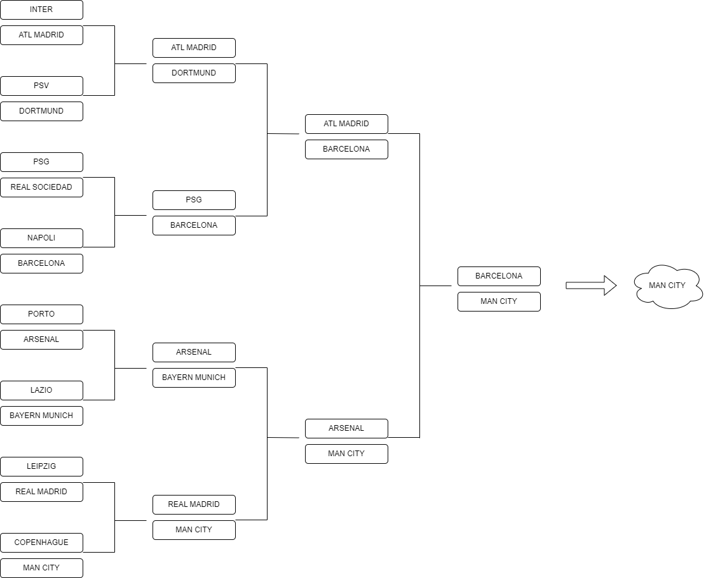

link repo: https://github.com/ingenieras-ingeniosas/IA_Champions

# Predicción ganador UEFA Champions League 23-24

## Obtención de datos

### Datos entrenamiento
- Estadísticas UCL 22/23 (todas)
- Estadísticas UCL 22/23 (fase grupos)
- Estadísticas liga nacional 22/23
- Estadísticas liga nacional 23/24 (hasta la fecha)

Ponderación Ligas Nacionales: 
- Tier1 (ENG, ESP, FR, IT, GER) : $Est_Nac$
- Tier (NL, DEN, PT) : $0.67*Est_Nac$
  
Ponderación con UCL:
$ \frac{Est_UCL + 0.5*Est_Nac}{2} $

### Datos evaluación
Estadísticas UCL 22/23 (octavos)

## Modelos
- ML: rergesión lineal, árbol
- DL: ANN

## Resultados

